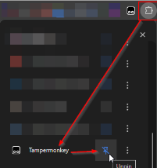
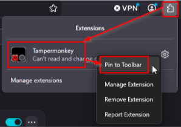
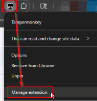
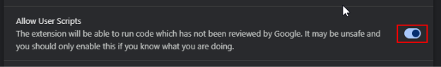
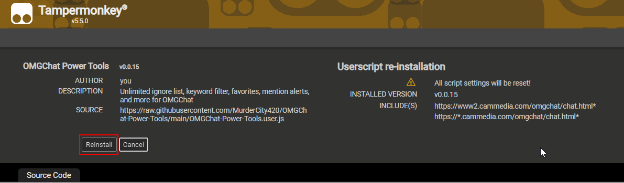

# Chat Power Tools

A feature-rich Tampermonkey userscript for OMGChat that adds an unlimited ignore list, keyword filtering, favorites, mention alerts, and much more.

**Current Version: 0.0.78**

---

## Features

| Feature | Description |
|---|---|
| **Alerts** | Get visual and audio notifications when your username or custom keywords appear in chat |
| **Favorites** | Highlight specific users so they always stand out in chat |
| **Keyword Filter** | Automatically replace or hide unwanted words from the chat feed |
| **Unlimited Ignore List** | Block as many users as you want — no limits |
| **Block Visibility** | See who has blocked you |
| **Hide Clutter** | Hide slots, rolls, rates, tip notifications, and more |
| **Unicode Support** | Enable unicode characters in your messages |
| **Emoji Picker** | Built-in emoji picker with categorized tabs |
| **Character Counter** | See how many characters remain as you type |
| **Smart Font Contrast** | Automatically adjusts font color for readability |
| **Scroll Lock Helper** | Keep your place in chat without losing new messages |
| **Peek Mode** | Temporarily unblock someone to read a message |
| **Guest Cammer Auto-Block** | Automatically block guest cammers |
| **Fan Mail Manager** | Send, reorder, and delete fan mail entries |
| **Holiday Icons** | Easter-egg icons for various holidays and occasions |

---

## Installation

### Step 1 — Install Tampermonkey

Click the link for your browser and follow the prompts to add the extension:

- **[Chrome](https://chrome.google.com/webstore/detail/tampermonkey/dhdgffkkebhmkfjojejmpbldmpobfkfo)**
- **[Firefox](https://addons.mozilla.org/en-US/firefox/addon/tampermonkey/)**
- **[Edge](https://microsoftedge.microsoft.com/addons/detail/tampermonkey/iikmkjmpaadaobahmlepeloendndfphd)**

---

### Step 2 — Pin Tampermonkey to Your Toolbar

Pinning puts the Tampermonkey icon in your toolbar so you can access it quickly.

**Chrome / Edge** — Click the puzzle-piece Extensions icon in the top-right corner, then click the 📌 pin next to Tampermonkey.

**Firefox** — Right-click the Tampermonkey icon that appears after install and select **Pin to Toolbar**.

| Chrome / Edge | Firefox |
|:---:|:---:|
|  |  |

---

### Step 3 — Allow User Scripts *(Chrome and Edge only — Firefox skip this step)*

Chrome and Edge require one extra setting before userscripts will run.

1. Right-click the **Tampermonkey icon** in your toolbar
2. Click **Manage Extension**
3. On the extension page, scroll down and turn on **Allow access to file URLs** and **Allow User Scripts**

| Step 3a — Manage Extension | Step 3b — Enable the setting |
|:---:|:---:|
|  |  |

---

### Step 4 — Install the Script

Click the button below. Tampermonkey will open a page asking you to confirm the install.

**➡️ [Install Chat Power Tools](https://raw.githubusercontent.com/MurderCity420/OMGChat-Power-Tools/main/OMGChat-Power-Tools.user.js)**

Click **Install** on the confirmation page.

| Tampermonkey install confirmation |
|:---:|
|  |

---

### Step 5 — Reload OMGChat

**Refresh your Chat tab. The Power Tools (Green SHeild) panel will appear automatically. You're done!**

---

## Updating

The script **is supposed to** check for updates automatically. To manually trigger an update:

1. Click the Tampermonkey icon
2. Select **Dashboard**
3. Find **Chat Power Tools** and click the reload/update icon

**Or simply click the install link above**

---

## Disabling or Uninstalling

### Temporarily Disable

If you want to turn the script off without losing your settings:

1. Click the **Tampermonkey icon** in your toolbar
2. You will see **Chat Power Tools** listed with a toggle switch next to it
3. Click the toggle to turn it **off** (grey = disabled)
4. Refresh your OMGChat tab — the script will no longer run

To re-enable, click the toggle again so it turns **blue/green**, then refresh.

| Tampermonkey menu — toggle the script on or off |
|:---:|
|  |

### Permanently Uninstall

To remove the script and all its saved data completely:

1. Click the **Tampermonkey icon** in your toolbar
2. Click **Dashboard**
3. Find **Chat Power Tools** in the list
4. Click the 🗑️ **Delete** (trash) icon on the right
5. Confirm the deletion

Your Tampermonkey extension itself will remain — only the Chat Power Tools script is removed.

---

## Usage

Once installed, a **Power Tools** panel or button will appear on your Chat page as a Green Sheild. Each feature section can be toggled independently.

### Alerts
Add your username or any keyword to the Alerts list. Whenever that word appears in chat you'll see a visual flash (🔔 Mention!) and optionally hear a sound.

### Favorites
Add usernames to your Favorites list. Their chat messages will be highlighted in a distinct color so you never miss them.

### Keyword Filter
Enter words you don't want to see. The script will replace or hide those words wherever they appear in the chat feed.

### Ignore List
Add users to your ignore list. Unlike the built-in block, this list is stored locally and is unlimited in size.

---

## Browser Compatibility

| Browser | Supported |
|---|---|
| Chrome | ✅ |
| Edge | ✅ |
| Firefox | ✅ |
| Safari | ❌ (Tampermonkey not supported) |

---

## License

[MIT](LICENSE) © 2026 MurderCity420
