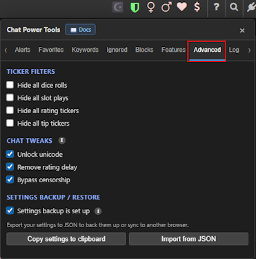

# Advanced

[← Back to README](../README.md) · [All docs](getting-started.md)

The **Advanced** tab holds ticker filters, local chat tweaks, and settings backup/restore. (Feature toggles like the emoji picker, auto-rate, and guest handling live on the **[Features](features.md)** tab.)

| The Advanced tab |
|:---:|
|  |

---

## Ticker filters

Hide the noisy game/economy tickers:

- **Hide all dice rolls**
- **Hide all slot plays**
- **Hide all rating tickers**
- **Hide all tip tickers** (e.g. "user1 sent 10 Tokens to user2")

---

## Chat tweaks

> The server may still enforce its own rules — these only disable the **local** checks.

- **Unlock unicode** — allow unicode characters in your messages.
- **Remove rating delay** — drop the client-side cooldown between ratings.
- **Bypass censorship** — skip the local censored-word replacement.

---

## Settings backup / restore

- **Settings backup is set up** — tick this once you've configured cloud backup (see **[Syncing your settings](syncing-settings.md)**); it hides the reminder in the panel header. Untick to bring the reminder back.
- **Copy settings to clipboard** — exports all your settings as JSON.
- **Import from JSON** — click once to reveal a paste box, paste exported JSON, then click again to import. Reload the page afterward to apply everything.

This JSON export/import is a quick manual way to move settings between browsers. For automatic, hands-off syncing, set up cloud backup instead — see **[Syncing your settings](syncing-settings.md)**.

---

**Related:** [Features](features.md) for the toggles that moved off this tab · [Log & Sync](logs-and-sync.md) to see what the tool did.
