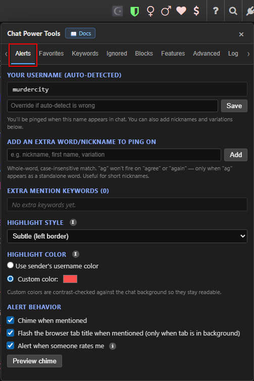

# Alerts

[← Back to README](../README.md) · [All docs](getting-started.md)

The **Alerts** tab pings you when your username — or any keyword you choose — appears in chat.

| The Alerts tab |
|:---:|
|  |

---

## Your username

Your name is auto-detected from the chat. If detection is wrong, type the correct name in the **override** box and save. Alerts fire whenever that name appears (as `@you` or as a standalone word).

---

## Extra keywords / nicknames

Add other words that should ping you — nicknames, a shortened first name, common misspellings.

- Matching is **whole-word and case-insensitive**: a keyword of `ag` fires only on a standalone "ag", never inside "again" or "agree".
- Useful for short nicknames that would otherwise cause false pings.

---

## Highlight style

Choose how a message that mentions you is marked:

| Style | Look |
|---|---|
| **Subtle** | Faint left border + gradient |
| **Strong highlight** | Solid background tint |
| **Bold** | Bold text |
| **Box** | Full border around the message |

**Highlight color** can be the default gold, the **sender's username color**, or a **custom color** (custom colors are contrast-checked against your chat background so they stay readable).

---

## Alert behavior

- **Chime when mentioned** — a soft two-note bell.
- **Flash the browser tab title** — flashes `🔔 Mention!` when the tab is in the background.
- **Alert when someone rates me** — fires the same chime/flash whenever you receive a rating (any score), so you know who just rated you.
- **Preview chime** — plays the sound so you can check your volume.

| Alert highlights in chat |
|:---:|
|  |

---

**Related:** [Favorites](favorites.md) uses the same highlight-style options for people you choose.
