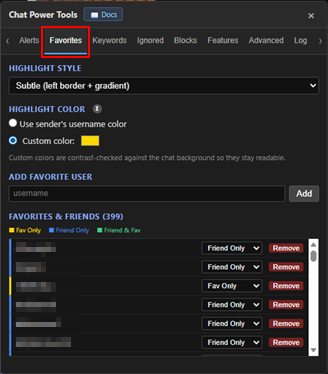
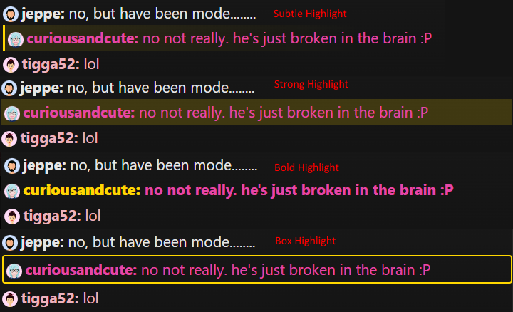

# Favorites

[← Back to README](../README.md) · [All docs](getting-started.md)

The **Favorites** tab highlights messages from people you care about so they never get lost in a busy room.

| The Favorites tab |
|:---:|
|  |

---

## Adding favorites

Type a username and click **Add**, or use the in-chat menu: click a user's name/avatar and choose **FAVORITE**. Remove anyone from the list with the **Remove** button. The **Search / filter** box next to Add narrows the list below — it matches current names **and** former usernames.

---

## The Favorites & Friends list

The list is a fixed-height (260px) scrolling area showing everyone you've marked, with a **member / guest / mod / verified-model** badge and a colored left edge:

- 🟡 **Fav Only** · 🔵 **Friend Only** · 🟢 **Friend & Fav**

Click any of those labels at the top to **filter** the list to that group; click **All** to show everyone. **Click a username** to open their profile in a new tab; **hover** it to see any former usernames (renames are tracked). You can also **highlight a name and Ctrl+C** to copy it.

**Friends** come from the site automatically (your star list) and can't be edited here. **Favorites** are added/removed from the in-chat user menu (or the **Add** box above). The **Remove** button appears only on rows where the person is a Favorite (Fav Only or Friend & Fav); it clears the Favorite flag only and does **not** change their Friend/star status on the site.

---

## Highlight style & color

Same four styles as [Alerts](alerts.md):

| Style | Look |
|---|---|
| **Subtle** | Faint left border + gradient |
| **Strong highlight** | Solid background tint |
| **Bold** | Bold text |
| **Box** | Full border around the message |

**Highlight color** options:

- **Default (gold)**
- **Use the sender's username color** — matches each favorite's own name color
- **Custom color** — pick any color

The "Use sender's username color" and "Custom color" options (with its color swatch) sit on the same row.

Changing the style or color re-applies instantly to messages already on screen.

| A favorited user's message highlighted |
|:---:|
|  |
