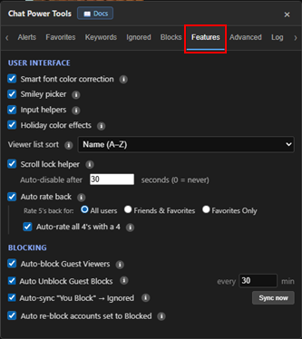
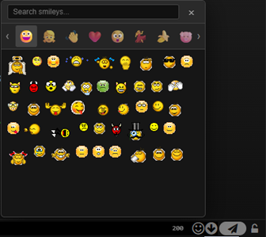

# Features

[← Back to README](../README.md) · [All docs](getting-started.md)

The **Features** tab collects the optional enhancements, grouped into **User interface** and **Blocking**.

| The Features tab |
|:---:|
|  |

---

## User interface

- **Smart font color correction** — detects your chat background and rewrites incoming message colors that don't have enough contrast (keeps the hue; affects only your view).
- **Smiley picker** — replaces the default smiley popup with a modern, categorized, searchable picker (works in main chat and IM windows).
- **Input helpers** — shows a live character counter by the input; turns red as you approach the ~200-char server limit.
- **Holiday color effects** — colors usernames with a holiday palette on special days. The holiday icon/tooltip stay regardless of this toggle.
- **Viewer list sort** — sort your "Watching Me" viewers by **none / name / gender / cam-on** (dropdown to the right).
- **Scroll lock helper** — a floating jump-to-bottom arrow appears when scroll lock is on and you've scrolled up. Optional **auto-disable after N seconds**.
- **Auto rate back** — when someone rates you, rate them back. Sub-options:
  - **Rate 5's back for:** **All Users** / **Friends & Favorites** / **Friends Only** / **Favorites Only**.
  - **Auto-rate all 4's with a 4** — also return 4s (applies to everyone).

| Modern emoji picker |
|:---:|
|  |

---

## Blocking

- **Auto-block Guest Viewers** — when a guest watches your cam, block them server-side immediately, then release the block after ~60 s to free the slot. Only acts while **you are broadcasting**.
- **Auto Unblock Guest Blocks** — scans your Blocked Users page on login and on the interval to its right (**every N min**, minimum 5; default 30) and unblocks anyone whose Type is **Guest**. Guests are throwaway accounts, so this stops dead guests from filling your 100-user block cap. *(The Blocks tab also has a manual "Remove all guest blocks now" button — see [Ignored & Blocks](ignore-and-blocks.md).)*
- **Auto-sync "You Block" → Ignored** + **Sync now** — backs up the **members** on your server block list (guests skipped) so they can be auto-re-blocked if they fall off the cap. **Sync now** runs it immediately.
- **Auto re-block accounts set to Blocked** — every 30 s, if someone in your **Blocked** tier enters the room while not currently blocked (the 100-cap pushed them off), they're re-blocked. Only the **Blocked** tier — never Alerts/Ignored. Account-scoped to the logged-in account.
- **Allow Mod Blocking** — by default the site only lets moderators/models block another moderator; for everyone else, blocking a mod silently fails on the server. Turn this on to block mods anyway. Because the server won't keep that block (it does **not** consume one of your 100 slots), it's **re-applied automatically at every login** — it shows in your console and the Blocks tab, but is session-only. *(If you're a mod or model yourself, you can block mods without this setting; it's detected automatically when you log in.)*

> The tier system (Alerts / Ignored / Blocked) is managed on the **[Ignored](ignore-and-blocks.md)** tab. The Blocked checkbox for a moderator is disabled unless you're a mod/model or have **Allow Mod Blocking** on.

---

**Related:** [Ignored & Blocks](ignore-and-blocks.md) · [Advanced](advanced.md) · [Log & Sync](logs-and-sync.md)
