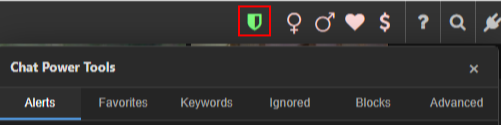
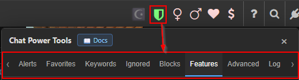

# Getting Started

[← Back to README](../README.md)

Once installed, Chat Power Tools adds a single control to the Chat Site: a green **🛡️ shield** icon in the chat top bar.

| The shield opens the Power Tools panel |
|:---:|
|  |

Click it to open (or close) the **Power Tools** panel.

---

## The panel and its tabs

The panel is organized into tabs. Click a tab to switch to it; the data-backed tabs refresh automatically every time you open the panel or click the tab.

Left to right, the tabs are: **Alerts, Favorites, Filters, Automations, Ignored, Blocks, Settings**. Settings holds **Features, Cams, Advanced, Power, Data,** and **Log** as sub-tabs (Power is hidden by default).
| Tab | Purpose |
|---|---|
| **Alerts** | Get pinged when your name/keywords appear — [docs](alerts.md) |
| **Favorites** | Highlight specific users — [docs](favorites.md) |
| **Filters** | Redact or hide words — [docs](keywords.md) |
| **Automations** | Auto rate-back, auto booms, auto reply, and Fan Mail — [docs](automations.md) |
| **Ignored** | Per-user Alerts / Ignored / Blocked tiers — [docs](ignore-and-blocks.md) |
| **Blocks** | Manage your server block list + guest cleanup — [docs](ignore-and-blocks.md) |
| **Features** | Emoji picker, smart contrast, guest blocking… — [docs](features.md) |
| **Advanced** | Ticker filters, chat tweaks — [docs](advanced.md) |
| **Data** | Backup, restore & Firebase cross-device sync — [docs](data.md) |
| **Log** | The diagnostic log — [docs](logs-and-sync.md) |
| **Power** | Bypass site-enforced rate limits and muting — [docs](power.md) |

| The panel tab bar |
|:---:|
|  |

---

## Closing the panel

- Click the shield again, **or**
- Click anywhere outside the panel, **or**
- Press **Esc**.

---

## Settings are saved automatically

Every toggle and list is stored locally by Tampermonkey the moment you change it — there's no "Save" button. Your settings persist across reloads.

> Want the same settings on another computer or browser? See **[Syncing your settings](syncing-settings.md)** — back them up to OneDrive or Google Drive.

> **Multiple accounts, one browser?** Tampermonkey storage is shared across every Chat Site account you use in the same browser. Block-related auto-actions are **account-scoped** so one account won't act on another's lists, but favorites/keywords/etc. are shared. See [Ignored & Blocks](ignore-and-blocks.md) for details.

---

**Next:** pick a tab from the table above, or start with [Alerts →](alerts.md).
