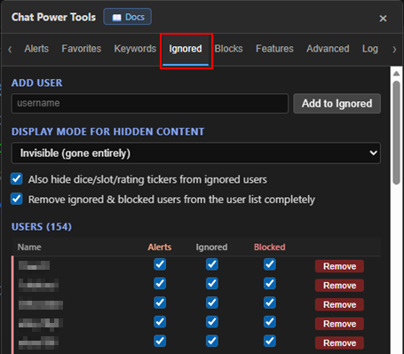
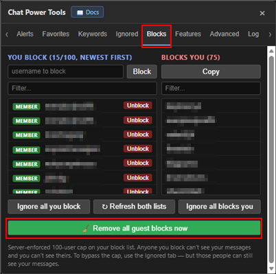

# Ignored & Blocks

[← Back to README](../README.md) · [All docs](getting-started.md)

These two tabs work together to manage who you mute and who you block. They share one idea: every user can sit in a **tier**.

---

## The tier system

Each user can be placed in one of these tiers. The **Ignored** tab manages the two app-side tiers (**Alerts** and **Ignored**); the site-level **Blocked** tier is managed on the **Blocks** tab.

| Tier | Effect | Includes | Managed on |
|---|---|---|---|
| **Alerts** | Suppresses notifications from them only | — | Ignored tab |
| **Ignored** | Hides all their messages | + Alerts | Ignored tab |
| **Blocked** | Server-side block (they can't see you, you can't see them) | + Ignored + Alerts | Blocks tab |

On the Ignored tab, **Alerts** and **Ignored** are **cumulative** — checking **Ignored** auto-checks **Alerts**; unchecking **Alerts** clears **Ignored** (you'll get a confirmation first, since it removes them from the list entirely). **Remove** clears both.

**Blocking never removes anyone from the site except one way:** the **Blocks tab → Unblock** button. Lowering someone's Alerts/Ignored tier — or any other automatic path — will **never** unblock them on the site. This is a deliberate safety guard so an accidental click or a lost local list can't wipe your server block list. See [Features → Blocking](features.md#blocking) for the full block-list safety behavior (master list beyond the 100-cap, "site is authoritative when the app is behind," and the automatic freeze on a sudden collapse).

Each row shows a **member / guest / mod / verified-model** badge and a colored left edge by tier (🟡 Alerts · 🟠 Ignored). **Click a username** to open their profile in a new tab; **hover** it to see any former usernames (renames are tracked). You can also **highlight a name and Ctrl+C** to copy it. **Click a column header** (Alerts / Ignored) to filter the list to that tier; click the active header again to show all.

> **Blocking moderators:** the site only lets mods/models block another moderator; for everyone else, blocking a mod silently fails server-side. To block mods anyway, turn on **Allow Mod Blocking** on the **[Features → Blocking](features.md)** tab — that block is session-only (it doesn't use a server slot) and is re-applied at each login. If you're a mod/model yourself, you can block mods without that setting.

| The Ignored tab — Name / Alerts / Ignored / Remove |
|:---:|
|  |

### Display mode for hidden content

Choose what an ignored message looks like:

- **Invisible** — gone entirely
- **Collapsed** — a clickable placeholder you can expand
- **Blurred** — blurred until you hover

Other options on the Ignored tab:

- **Hide dice/slot/rating tickers from ignored users**
- **Remove ignored & blocked users from the user list completely**

The **Search / filter** box next to the Ignore field narrows the list — it matches current names **and** former usernames (as do the filter boxes on the Blocks tab).

> **Tip:** click a user's name/avatar in chat and choose **IGNORE** / **FAVORITE** from the menu.

> The automatic **block-list sync** and **re-block** options (Auto-sync "You Block" → Ignored, Sync now, Auto re-block accounts set to Blocked) now live on the **[Features → Blocking](features.md)** tab.

---

## The Blocks tab

| The Blocks tab |
|:---:|
|  |

**You Block** (left) shows your server block list, **newest first** to match the site, with a **member / guest / mod / verified-model** badge on each entry and a clickable username (opens their profile in a new tab):

- **Unblock** — removes them server-side (and from your tiers).
- **Filter** box to search.

**Blocks You** (right) shows accounts that have blocked *you* (read-only; **Copy** to clipboard).

Buttons:

- **↻ Refresh both lists** — re-reads everything from the server.
- **Ignore all you block / Ignore all blocks you** — bulk tier actions.

The server enforces a **100-user block cap**; older blocks get pushed off as you add new ones. To mute beyond the cap, use the **Ignored** tier instead (one-way: they can still see you).

---

## Guest-block auto-cleanup

Guests are throwaway accounts. The site only auto-releases a guest block after ~1 minute **while you stay in the room** — if you leave, the block sticks and slowly fills your 100-cap, pushing off real blocks.

The Blocks tab has a manual one-click cleanup:

- **🧹 Remove all guest blocks now** — sweeps your block list and unblocks every guest immediately.

To run that sweep **automatically** on a schedule, turn on **Auto Unblock Guest Blocks** (with its **every N min** interval) on the **[Features → Blocking](features.md)** tab. The sweep also runs once shortly after you log in, and guests are never kept in your Ignored/Blocked tiers.

| Manual guest cleanup button |
|:---:|
|  |

---

**Related:** [Features → Blocking](features.md) for **Auto-block Guest Viewers** (blocks guests who watch *your* cam) and the automatic guest-unblock/sync settings. [Log & Sync](logs-and-sync.md) records every block/unblock the tool performs.
