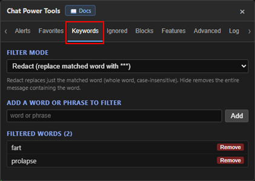
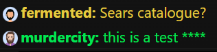

# Keywords

[← Back to README](../README.md) · [All docs](getting-started.md)

The **Keywords** tab filters words you don't want to see in the chat feed.

| The Keywords tab |
|:---:|
|  |

---

## Filter modes

Pick how matched words are handled:

- **Redact** *(default)* — replaces just the matched word with asterisks (`****`), leaving the rest of the message intact. Whole-word, case-insensitive (so `class` won't match inside `classic`).
- **Hide** — hides the **entire message** that contains the word.

---

## Managing the list

- Type a word or phrase and click **Add**.
- Remove any entry with its **Remove** button.

All keywords are stored lowercase and matched case-insensitively.

| Redacted message example |
|:---:|
|  |
