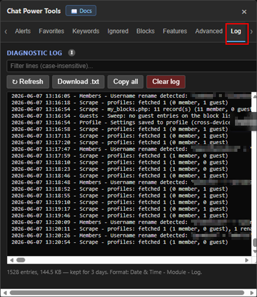

# Log & Sync

[← Back to README](../README.md) · [All docs](getting-started.md)

This page covers the **Log** tab plus two background features: **profile sync** and **friend (Stars) sync**.

---

## The diagnostic Log

The **Log** tab records what Chat Power Tools *does* — syncs, blocks, unblocks, guest sweeps, page scrapes, cam fixes, rename detection, and more. It does **not** log chat messages.

| The Log tab |
|:---:|
|  |

- **Format:** one human-readable line per event — `YYYY-MM-DD HH:MM:SS - Module - message`.
- **Retention:** 3 days (older lines auto-prune).
- **Modules:** `Init`, `Blocks`, `Guests`, `Sync`, `Profile`, `Friends`, `Cam`, `Rate`, `Members`, `Scrape`.
- **Controls:** Filter, **Refresh**, **Download .txt**, **Copy all**, **Clear log**.

This is the first thing to grab when reporting a problem — open the tab, **Copy all**, and paste it into your bug report.

> The Log tab also has a collapsed **Pre-wipe snapshots** section: whenever the chat is wiped, the visible chat is saved here first (last 10).

---

## Profile sync *(cross-device settings)*

Optionally mirrors your settings to your OMGChat **profile** ("More About Me") as a hidden, obfuscated comment.

- **On login:** if the profile copy is newer than your local copy (e.g. saved from another device), it's restored.
- **Periodically:** your current settings are written back to the profile.

This lets you keep the same favorites, ignore tiers, keywords, etc. across browsers/devices that share the same account. It's lightweight obfuscation, not encryption — don't store secrets in your profile.

> **Superseded by Firebase:** when you enable **[Firebase Sync](firebase-sync.md)** on the Data tab, profile sync is paused automatically — Firebase becomes the single source of truth, with live newest-wins merging across devices.

---

## Friend (Stars) sync

Reads your site **Stars** list and mirrors it into the tool, so your starred users are recognized as friends. Runs on login (throttled to roughly twice a day) and walks all pages of your Stars list. UID lookups during the scan also power automatic **username-rename detection** for members.

---

**Related:** [Firebase Sync](firebase-sync.md) for live cross-device sync · the [Blocks tab](ignore-and-blocks.md) and [Advanced](advanced.md) features are the main things that show up in the Log.
