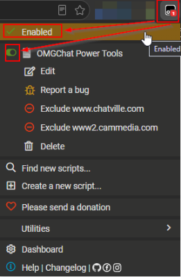

# Updating & Uninstalling

[← Back to README](../README.md) · [All docs](getting-started.md)

---

## Updating

The script checks for updates automatically through Tampermonkey. To update manually:

1. Click the **Tampermonkey icon** in your toolbar.
2. Select **Dashboard**.
3. Find **Chat Power Tools** and click the reload/update icon.

…or simply re-open the **[install link](https://raw.githubusercontent.com/MurderCity420/Chat-Power-Tools/main/Chat-Power-Tools.user.js)** and confirm.

Your settings are preserved across updates.

| Tampermonkey dashboard — update icon |
|:---:|
|  |

---

## Temporarily disable

To turn the script off **without losing your settings**:

1. Click the **Tampermonkey icon**.
2. Find **Chat Power Tools** with its toggle switch.
3. Click the toggle **off** (grey = disabled).
4. Refresh your OMGChat tab.

Re-enable by toggling it back on and refreshing.

| Tampermonkey menu — enable/disable toggle |
|:---:|
|  |

---

## Permanently uninstall

To remove the script **and all its saved data**:

1. Click the **Tampermonkey icon** → **Dashboard**.
2. Find **Chat Power Tools** in the list.
3. Click the 🗑️ **Delete** (trash) icon and confirm.

The Tampermonkey extension itself stays installed — only Chat Power Tools is removed.

> **Note:** uninstalling deletes your locally stored lists (favorites, tiers, keywords, logs). If you use [profile sync](logs-and-sync.md), a copy may still exist on your OMGChat profile.
